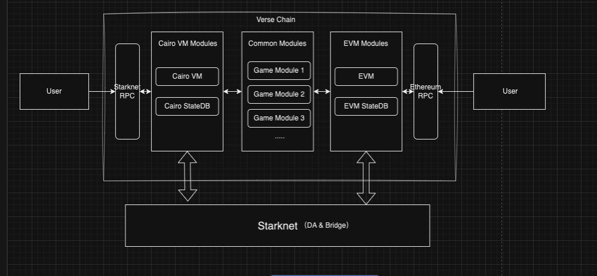

## Verse Chain

Verse builds a modular infrastructure and economic layer for on-chain games with CairoVM and EVM compatibility.

## Verse Chain Technical Brief

Verse leverages the **Itachi** infrastructure to introduce a specialized **Fractal Scaling Solution** for gaming applications.

Through smart contracts and chain-native modules, we enable developers to efficiently utilize functions and tools such as onchain VRF, AA wallets, and zk game general circuit. We also incorporate a few innovative EIPs such as EIP-5564 and EIP-6538 at the chain level, optimizing transaction efficiency and security, to empower game developers with more tool-kits and to enhance user experience.

Significantly, Verse bridges the gap between EVM and CarioVM via our unique parallel-chains structure, by creating chain-native common modules and making both EVM and CarioVM settle in the StarkNet, achieving higher compatibility across different virtual machines.

Verse is set to transition from a single sequencer to a shared validation model with Itachi, marking a significant step toward scalability and decentralization.

  

## Verse Modules

Verse will provide games with contract-based and native blockchain components, significantly reducing development costs. With the introduction of native blockchain modules, games will easily have access to features such as random number generation and anti-MEV capabilities, which are difficult to implement on other blockchains.

**On-chain VRF (Verifiable Random Function):**

Verse provides a necessary source of randomness for games via on-chain VRF, ensuring the fairness and unpredictability of game outcomes. This is particularly important for games that require fair random results, such as online card games and gambling applications. The on-chain VRF secures the generation of random numbers in a cryptographically safe manner, preventing any possibility of manipulation.

**zk Game General Circuits:**

Utilizing Zero-Knowledge Proof (ZKP) technology, the Verse platform can verify the correctness of game states and player actions without revealing any player information. This not only enhances the security of the games but also protects the privacy of the players.

**ZK Governance:**

Zero Knowledge Governance (ZK Governance) offers a comprehensive solution to these challenges by balancing the need for transparency in governance with the privacy of individual voters.

**Anti-Mev:**

FOCG will encounter very serious MEV attack issues. Bots can fully monitor opponents' actions and respond accordingly, gaining a first-mover advantage by manipulating gas fees.

We will address game-related MEV attacks using VerseChain's native modules.
