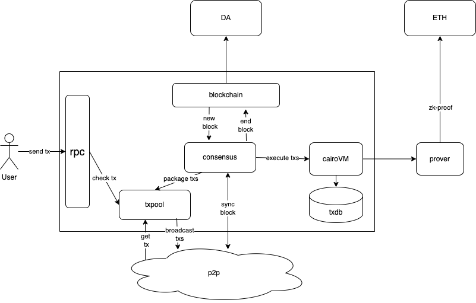
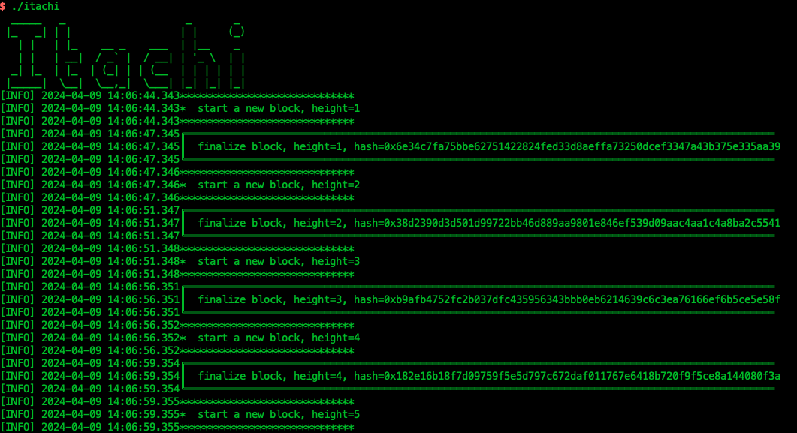

# itachi

Welcome to **itachi**, the much easier and more flexible modular stack to build Layer 2 or Layer 3 chains using Cairo and the [Starknet](https://www.starknet.io/) technology.
It's open source for everyone to use.

Itachi is built on the [Yu](https://github.com/yu-org/yu) framework which not only makes it modular but also gives developers
a simpler and more user-friendly development experience, just as simple as developing a web backend.

It is specifically easy and helpful if you want to quickly own more of the stack and get more control over your chain.

## Overall Structure



## Cairo Compatible

- cairo-vm: 0.8.3
- cairo-lang: 2.4.0

## Build & Run

### Prerequisites

- rustc 1.74.0 (79e9716c9 2023-11-13)
- go 1.21

### Docker Pull & Run

```shell
docker pull ghcr.io/reddio-com/itachi:latest
docker-compose up
```

### Source code Build & Run

```shell
git submodule init
git submodule update --recursive --checkout
make build

./itachi
```

You can see the running results on your terminal.


### Reset Chain

Reset Chain will clean all the stored history data locally.

```shell
make reset
```

## Test

### [Starknet.py](https://github.com/software-mansion/starknet.py)

You can use more complete python tests with `starknet.py`: https://github.com/reddio-com/itachi-testing

### [starknetGo](https://github.com/haisenCx/starknet.go/tree/itachi_test)

You can use `starknetGo` for RPC unit testing. You can refer to the `itachi_test` branch in this fork used during RPC development：https://github.com/haisenCx/starknet.go/tree/itachi_test
Files with the \_test suffix in path `starknet.go/rpc` are unit tests for RPC.

## 🌐 Connect to Test Endpoint

https://itachi-dev.reddio.com/

## Configs

### Chain Configs

The default config file of Itachi chain is `conf/cairo_cfg.toml`

### Genesis Configs

The genesis configs of Itachi chain is same as Madara. You can learn more details by [docs](docs/genesis.md)

## Starknet RPC

### 0.5.1

- [x] addDeclareTransaction
- [x] addDeployAccountTransaction
- [x] addInvokeTransaction
- [x] call
- [x] estimateFee
- [x] getTransactionReceipt
- [x] getTransactionByHash
- [x] getNonce
- [x] getTransactionStatus
- [x] getClass
- [x] getClassAt
- [x] getClassHashAt
- [ ] blockHashAndNumber
- [ ] getBlockWithTxHashes
- [ ] getBlockWithTxs
- [x] chainId
- [ ] syncing
- [ ] getTransactionByBlockIdAndIndex
- [ ] getBlockTransactionCount
- [ ] estimateMessageFee
- [ ] blockNumber
- [x] specVersion
- [ ] traceTransaction
- [x] simulateTransactions
- [ ] traceBlockTransactions
- [x] getStorageAt
- [ ] getStateUpdate

### 0.6.0

- [x] addDeclareTransaction
- [x] addDeployAccountTransaction
- [x] addInvokeTransaction
- [x] call
- [x] estimateFee
- [x] getTransactionReceipt
- [x] getTransactionByHash
- [x] getNonce
- [x] getTransactionStatus
- [x] getClass
- [x] getClassAt
- [x] getClassHashAt
- [ ] blockHashAndNumber
- [x] getBlockWithTxHashes
- [x] getBlockWithTxs
- [x] chainId
- [ ] syncing
- [ ] getTransactionByBlockIdAndIndex
- [ ] getBlockTransactionCount
- [ ] estimateMessageFee
- [ ] blockNumber
- [x] specVersion
- [ ] traceTransaction
- [x] simulateTransactions
- [ ] traceBlockTransactions
- [x] getStorageAt
- [ ] getStateUpdate

### 0.7.0

- [x] addDeclareTransaction
- [x] addDeployAccountTransaction
- [x] addInvokeTransaction
- [x] call
- [x] estimateFee
- [x] getTransactionReceipt
- [x] getTransactionByHash
- [x] getNonce
- [x] getTransactionStatus
- [x] getClass
- [x] getClassAt
- [x] getClassHashAt
- [x] blockHashAndNumber
- [x] getBlockWithTxHashes
- [x] getBlockWithTxs
- [x] chainId
- [ ] syncing
- [x] getTransactionByBlockIdAndIndex
- [x] getBlockTransactionCount
- [x] estimateMessageFee
- [x] blockNumber
- [x] specVersion
- [ ] traceTransaction
- [x] simulateTransactions
- [ ] traceBlockTransactions
- [x] getStorageAt
- [x] getStateUpdate
